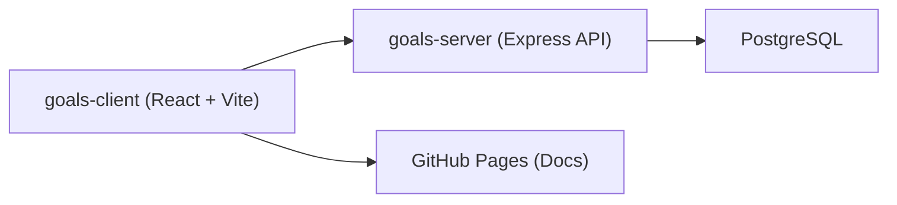

# Arquitectura

El sistema se compone de tres capas principales:

- `goals-client`: Interfaz web hecha con React + Vite.
- `goals-server`: API REST con Express (Node.js), autenticación y lógica de negocio.
- `PostgreSQL`: Persistencia de datos.

## Responsabilidades
- Frontend: Formularios de transacciones, presupuestos, tarjetas, reportes.
- API: Autenticación JWT, endpoints de categorías, tarjetas, transacciones, presupuestos, estadísticas.
- DB: Esquema relacional y restricciones.
