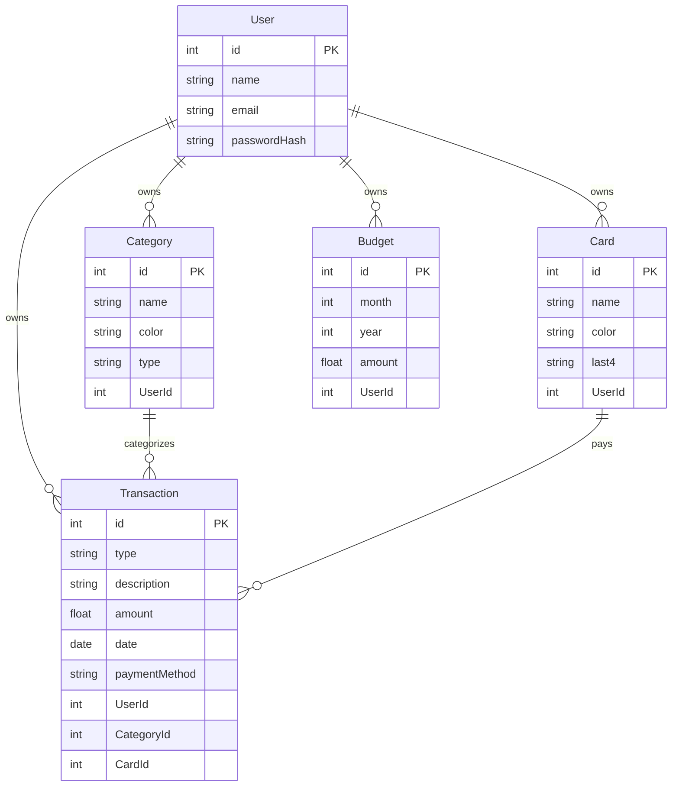

# Base de datos

## Esquema general

## Tablas y campos
- `User`
  - `email` único; `passwordHash` con bcrypt.
- `Category`
  - `type`: separa categorías de gastos e ingresos.
  - `color`: usado para gráficos y chips en UI.
- `Card`
  - `last4`: últimos 4 dígitos; `color` para identificación visual.
- `Transaction`
  - `type`: `expense` o `income`.
  - `paymentMethod`: `cash` o `card`; si `card`, `CardId` puede ser requerido por UI.
  - `CategoryId` y `CardId` permiten `NULL`.
- `Budget`
  - Por mes/año; un usuario puede tener varios presupuestos históricos.

## Relaciones y consideraciones
- Todas las tablas (excepto `User`) tienen `UserId` para asegurar propiedad.
- El cálculo de estadísticas filtra por fecha y tipo; las categorías en estadísticas se computan solo para gastos.
- Mantén `date` como `YYYY-MM-DD` para simplificar filtros por rango.
