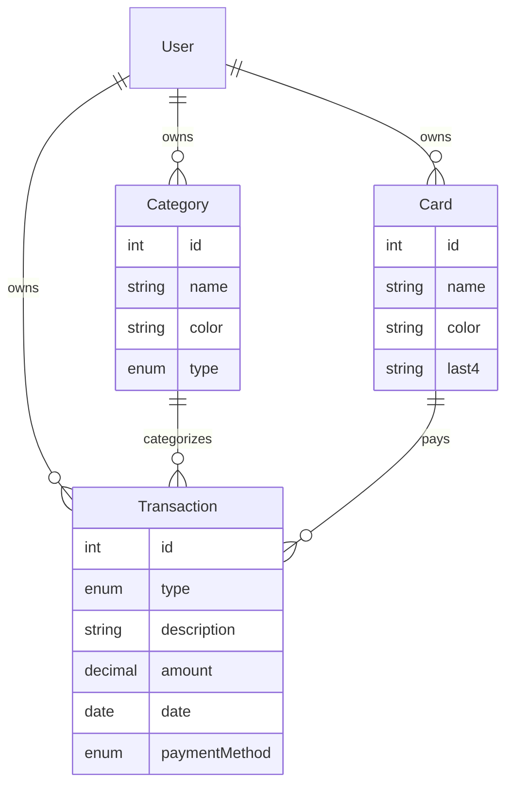

# Base de datos

## Esquema

```mermaid
erDiagram
  User ||--o{ Category : owns
  User ||--o{ Card : owns
  User ||--o{ Transaction : owns
  Category ||--o{ Transaction : categorizes
  Card ||--o{ Transaction : pays
  Transaction {
    int id
    enum type
    string description
    decimal amount
    date date
    enum paymentMethod
  }
  Category {
    int id
    string name
    string color
    enum type
  }
  Card {
    int id
    string name
    string color
    string last4
  }
```

## Notas
- `Transaction.type`: `expense` o `income`.
- `paymentMethod`: `cash` o `card`.
- Integridad referencial con claves foráneas.
